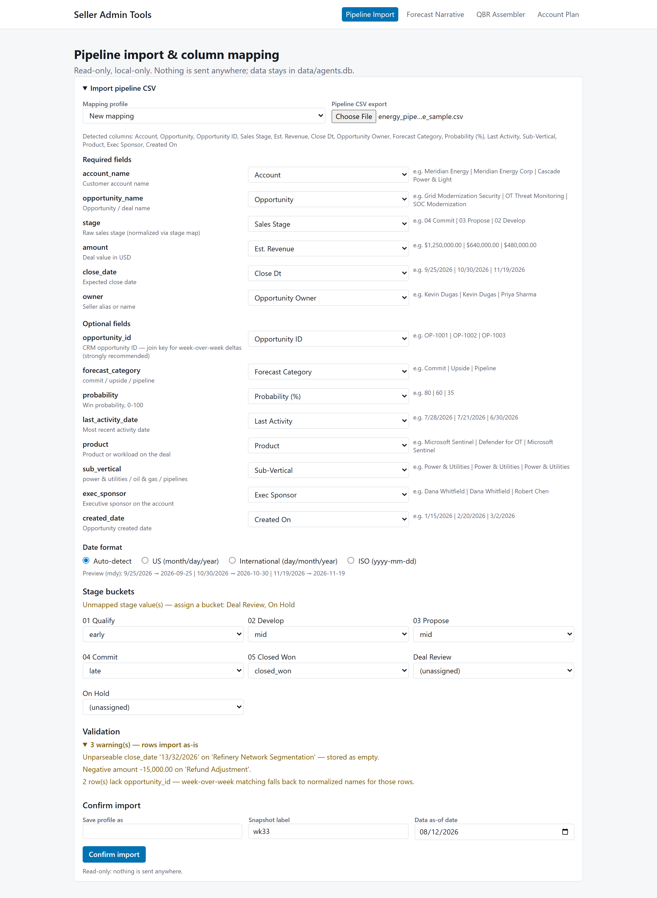
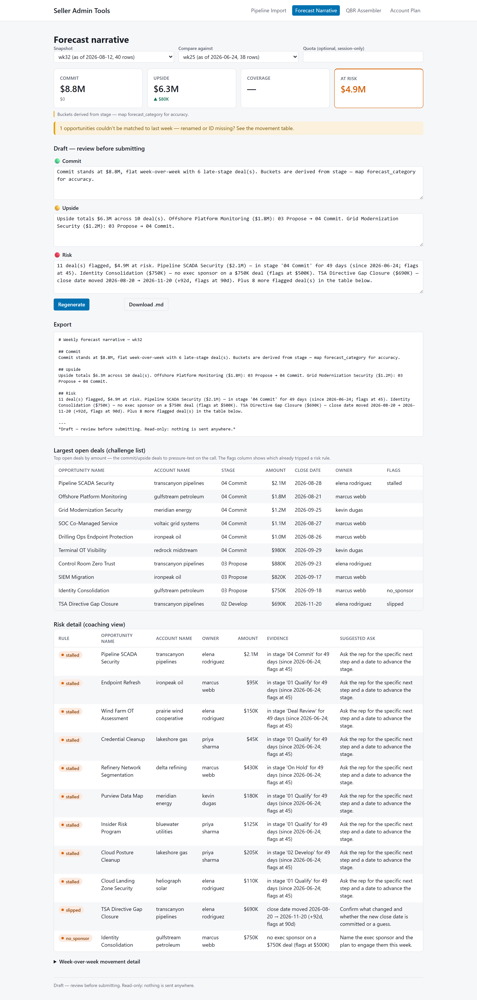
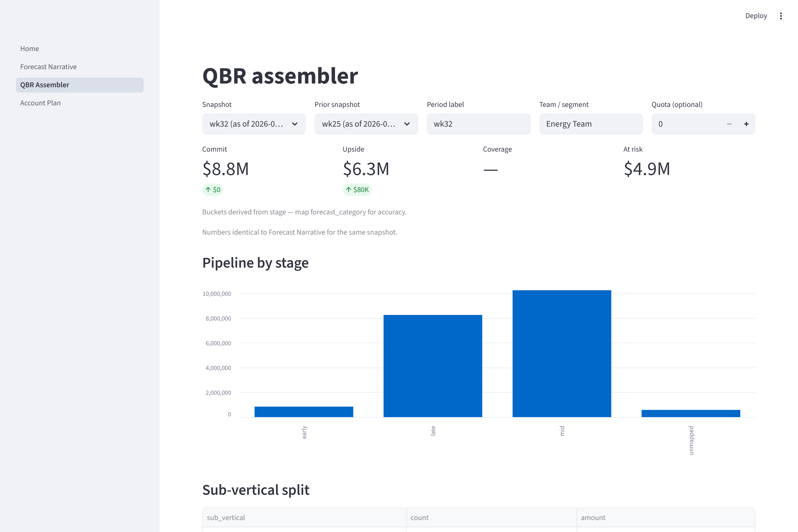
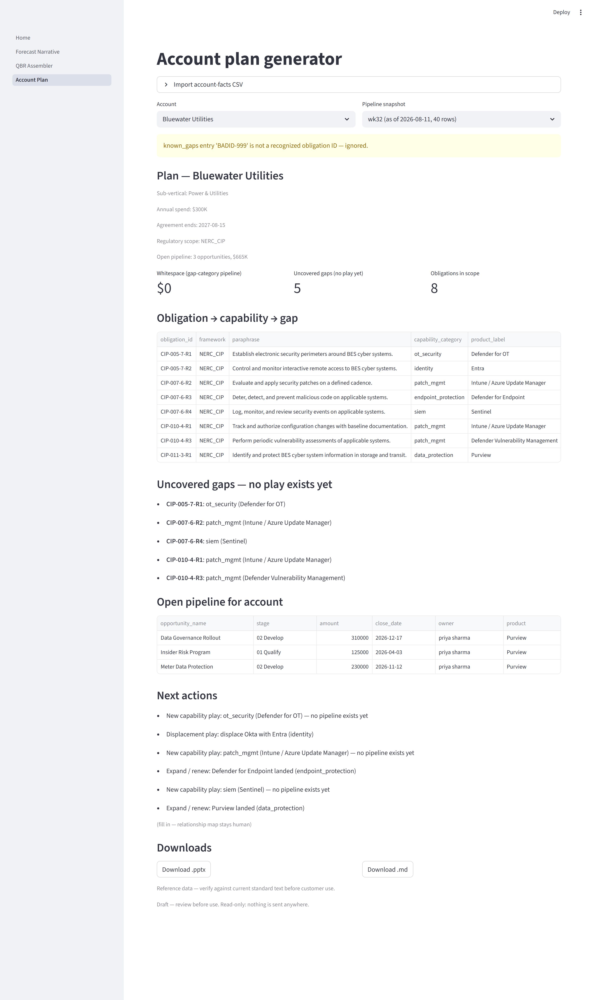

# Seller Admin Tools

A local, read-only toolkit that turns a weekly CRM pipeline export into the
administrative artifacts an enterprise seller produces by hand every week:
a forecast narrative, a QBR deck, and an account plan.

Everything runs on one machine. **No authentication, no network calls, no
telemetry** — data lives in a local SQLite file and Streamlit session state, and
every export is a local file download. The tools never write back to any CRM or
external system.

- **Vendor-neutral core.** No CRM-specific column names are hard-coded anywhere.
  A mapping screen translates *any* CSV export to a canonical schema, so a new
  export format is a 30-second remap, not a code change.
- **Deterministic.** Given the same snapshot, every tool produces byte-identical
  output. The QBR deck and the forecast narrative read the same analytics
  functions, so their numbers can never disagree.
- **Config-not-code.** Stage maps, name aliases, risk rules, narrative templates,
  and the compliance crosswalk all live in editable YAML under `config/`, read
  at call time.

---

## The four tools

| # | Tool | Input | Output |
|---|------|-------|--------|
| 0 | **Home / Ingest** | Any pipeline CSV export | A saved, reusable column-mapping profile + a stored snapshot |
| 1 | **Forecast Narrative** | A snapshot (+ the prior week) | Commit/upside/risk narrative with week-over-week movement, `.md` export |
| 2 | **QBR Assembler** | A snapshot (+ the prior week) | A 5-slide `.pptx` deck + `.md` appendix |
| 3 | **Account Plan** | Account-facts CSV + a snapshot | An account plan with a compliance gap crosswalk + whitespace estimate, `.pptx`/`.md` |

### 0. Home — ingest & column mapping



The foundation every tool builds on. Upload any pipeline CSV; the app:

1. Auto-suggests a mapping from your headers to the canonical schema (you confirm
   every field — suggestions are never applied silently).
2. Lets you resolve the date format with a live preview (`auto` infers from the
   data; ambiguous dates like `03/04/2026` force an explicit choice rather than
   guessing).
3. Assigns raw sales-stage strings to canonical buckets (`early | mid | late |
   closed_won | closed_lost`); unmapped stages surface for one-click assignment.
4. Validates the frame (unparseable dates, negative amounts, missing required
   fields, duplicate/blank opportunity IDs) — blocking errors vs. warnings.
5. Saves the mapping as a **named profile** so next week's export is a zero-click
   re-import, and stores the rows as an append-only snapshot (keyed by file hash,
   so re-importing the same file is caught).

#### Pipeline column contract

Map your export's columns to these canonical fields. The six required fields are
the minimum to import; each optional field unlocks a specific capability, so you
only map what you have.

| Canonical field | Req? | Type | Unlocks / notes |
|---|---|---|---|
| `account_name` | ✅ | text | Rollups, account-plan join (normalized; raw kept) |
| `opportunity_name` | ✅ | text | Deal identity in every artifact |
| `stage` | ✅ | text | Stage buckets → commit/upside/pipeline, stalled/late flags |
| `amount` | ✅ | money | Every dollar total (parenthesized negatives supported) |
| `close_date` | ✅ | date | Slip detection, `big_and_late` flag |
| `owner` | ✅ | text | Per-seller rollup (alias-normalized) |
| `opportunity_id` | — | text | **Join key for week-over-week deltas** — without it, rows match on normalized name (strongly recommended) |
| `forecast_category` | — | text | `commit`/`upside`/`pipeline` directly (else derived from stage) |
| `probability` | — | number | Win probability 0–100 |
| `product` | — | text | Account-plan whitespace crosswalk |
| `sub_vertical` | — | text | Sub-vertical split on the QBR |
| `exec_sponsor` | — | text | `no_sponsor` risk flag (skipped if unmapped) |
| `last_activity_date`, `created_date` | — | date | Reserved for future age/activity rules |

Types: **money** accepts `$`, thousands separators, and parenthesized negatives;
**date** is resolved once for the file (auto, US, International, or ISO) with a
live preview. Unmapped required fields **block** the import; data-quality issues
(bad dates, negative amounts, blank/duplicate IDs) are **warnings** — rows still
import, with the problem surfaced.

### 1. Forecast Narrative



Drafts the weekly commit / upside / risk story from a snapshot:

- **Bucket rollup** — commit/upside/pipeline totals, using `forecast_category`
  when present and falling back to a stage-derived category otherwise.
- **Week-over-week movement** — row-level matching: rows with an
  `opportunity_id` join on ID (so a renamed deal is *moved*, not
  new+disappeared); ID-less rows join on normalized names; anything left over is
  surfaced as an explicit `unmatched` count rather than silently miscounted.
- **Risk flags** — rule-based and evidence-backed (`config/risk_rules.yaml`):
  `stalled` (stage age past a threshold, measured per opportunity across
  snapshots), `slipped` (close date pushed out), `no_sponsor` (large deal with no
  exec sponsor), and `big_and_late` (large deal closing soon but not late-stage).
  Each flag carries a plain-English evidence string (with the firing threshold
  shown, so it is checkable) plus a configurable **suggested coaching ask** — the
  one question to put to the rep — editable in `config/risk_rules.yaml`.

The numbers are inserted verbatim; the editable prose stays under your control.
Export by copy or `.md` download.

### 2. QBR Assembler



One click from a snapshot to a five-slide `.pptx` (title, scorecard, pipeline-by-
stage native bar chart, top deals, risks & asks) plus a `.md` appendix. The
on-screen view and appendix also carry a **per-seller roll-up** (commit / upside
/ pipeline / at-risk, alias-normalized) and a **multi-week trend** of commit /
upside / at-risk across snapshots up to the selected week. Tables
are row/column-capped and long names truncated so slides never overflow; every
slide carries a `DRAFT` footer. A consistency-guard test parses the commit figure
back out of the built deck and asserts it equals the narrative's — the two views
share `core/forecast`, so they cannot drift.

<details>
<summary>Sample <code>.md</code> appendix (generated from the sample data)</summary>

```markdown
# Energy — West — Business Review (Q3 FY26 Business Review)

## Scorecard
- Commit: $8.8M ▬ flat
- Upside: $6.3M ▲ $80K
- Coverage: 1.3x
- At risk: $4.9M

## Pipeline by stage
- early: 8 deals, $845K (Δ -$4.0M)
- mid: 23 deals, $10.2M (Δ -$1.9M)
- late: 6 deals, $8.2M (Δ $6.2M)

## Risks & asks
- Pipeline SCADA Security ($2.1M): in stage '04 Commit' for 49 days (since 2026-06-23)
- Identity Consolidation ($750K): no exec sponsor on a $750K deal
- TSA Directive Gap Closure ($690K): close date moved 2026-08-20 → 2026-11-20 (+92d)
```
</details>

### 3. Account Plan



Joins an account-facts record (installed products, incumbent tools, regulatory
scope, spend) with that account's open pipeline to produce a plan with:

- An **obligation → capability → gap crosswalk** (`config/obligation_map.yaml`,
  `config/product_map.yaml`): each regulatory obligation in the account's scope is
  marked `landed` (a covering product is installed), `partial` (only a competitor
  tool covers it — a displacement play), or `gap`. Reference frameworks shipped as
  examples include NERC CIP, TSA Security Directives, and IEC 62443.
- A **whitespace estimate** — open pipeline whose product maps to a gap capability,
  summed, plus the list of gap capabilities with no pipeline yet. Products that
  can't be resolved are excluded and reported, never guessed.
- Rule-based **next actions** and export to `.pptx`/`.md`.

<details>
<summary>Sample account plan (generated from the sample data)</summary>

```markdown
# Account plan — Meridian Energy

## Obligation → capability → gap
| Obligation | Capability | Product | Status | Evidence |
|---|---|---|---|---|
| CIP-005-7-R2 | identity | Entra | landed | Entra ID |
| CIP-007-6-R3 | endpoint_protection | Defender for Endpoint | partial | CrowdStrike |
| CIP-007-6-R4 | siem | Sentinel | landed | Microsoft Sentinel |
| CIP-011-3-R1 | data_protection | Purview | gap |  |

## Whitespace
- Open pipeline against gap capabilities: $820K

## Next actions
- Displacement play: displace CrowdStrike with Defender for Endpoint (endpoint_protection)
- New capability play: patch_mgmt (Intune / Azure Update Manager) — no pipeline exists yet
```
</details>

---

## Quickstart

Requires Python 3.11+ (developed on 3.14).

```bash
pip install -r requirements.txt

# Seed the demo database with two weekly snapshots + sample account facts
python sample_data/seed_snapshots.py

# Launch the app
streamlit run app/Home.py
```

Then walk the pages in order: **Home** (the sample import is already seeded, or
upload `sample_data/energy_pipeline_sample.csv` yourself) → **Forecast Narrative**
→ **QBR Assembler** → **Account Plan**.

> The screenshots above are the live Streamlit UI running against the bundled
> sample data, and the `<details>` blocks show real, reproducible export output.
> Run the commands above to reproduce either.

## Run it hosted (Azure App Service)

To put the tools on a URL instead of a laptop, `deploy/azure-deploy.ps1` builds a
container image *inside Azure* (no local Docker) and provisions App Service for
Containers with the committed sample data baked in — all three tools populated:

```powershell
az login
./deploy/azure-deploy.ps1
```

It serves synthetic data with no auth by default; see
[deploy/README.md](deploy/README.md) for the one-command Entra (Microsoft
sign-in) gate to add before using real data. The `Dockerfile` also runs anywhere
Docker does (`docker build -t seller-admin-tools . && docker run -p 8000:8000
seller-admin-tools`).

## Sample data

- `sample_data/energy_pipeline_sample.csv` — 40 **fictional** rows (invented
  energy companies and contacts) that deliberately exercise every failure class:
  messy headers, a malformed date, an all-ambiguous date pair, a negative amount,
  blank opportunity IDs, unmapped stages, and one account spelled two ways.
- `sample_data/account_facts_sample.csv` — 5 fictional accounts, including an
  all-gap account and a name-mismatch case.
- `sample_data/seed_snapshots.py` — seeds a prior week (backdated, with deliberate
  mutations so week-over-week logic has something to find) and the current week
  via the same import path the UI uses.

## Configuration

All under `config/`, editable YAML read at call time — no code change needed:

| File | Purpose |
|------|---------|
| `stage_map.yaml` | Raw sales-stage string → canonical bucket |
| `aliases.yaml` | Account/owner name normalization (canonical → aliases) |
| `risk_rules.yaml` | Thresholds for the four risk flags |
| `narrative_templates.yaml` | Sentence templates for the forecast narrative |
| `obligation_map.yaml` | Regulatory obligation → required capability |
| `product_map.yaml` | Product/competitor names → capability category |

## For evaluators (cost, auditability, extensibility)

If you are weighing this against a commercial suite:

- **Cost of operation.** Zero infrastructure. It runs on one machine, fully
  offline — no accounts, API keys, per-seat licensing, or network egress. The
  only cost is a Python environment.
- **Auditability.** Every output is **deterministic** (same snapshot → byte-
  identical output; a test parses the commit figure back out of the built deck
  and asserts it equals the narrative's). Every risk flag carries a plain-English
  evidence string *including the firing threshold*, and all numbers are inserted
  verbatim — there is no model deciding them. Snapshots are append-only and
  keyed by file hash, so re-importing the same file is caught.
- **Extensibility.** All behavior lives in editable YAML read at call time —
  stage map, name aliases, risk thresholds + coaching asks, narrative wording,
  and the compliance crosswalk. A new CRM format is a column remap saved as a
  reusable profile, not a code change; the mapping/ingest pipeline is
  schema-parameterized (pipeline snapshots and account facts share it).
- **Deliberately absent** (vs. a commercial suite): CRM write-back, multi-user
  auth, scheduled/automatic refresh, region-level roll-ups, multi-currency, and
  AI-generated prose. These are out of scope by design — the point is an offline,
  deterministic, auditable toolkit, not a platform.

## Architecture

```
config/       editable YAML (stage map, aliases, rules, templates, crosswalk)
core/         pure logic, no UI:
                schema, ingest, mapping, store, importer   (foundation)
                forecast, narrative, formatting            (tools 1-2)
                deck, styles                               (tool 2)
                crosswalk, plan                            (tool 3)
app/          Streamlit entry (Home.py) + pages/ + shared render helpers
sample_data/  fictional sample CSVs + seed script
tests/        pytest suite (100 tests)
data/         SQLite database (created at runtime, git-ignored)
```

The `core/` modules are pure functions over stored snapshots with no Streamlit
imports, so all logic is exercised headlessly by the test suite. The Streamlit
pages are thin wrappers that call them.

## Data handling

- **The bundled sample data is entirely fictional.** Every company, contact, and
  deal in `sample_data/` is invented.
- **Real CRM exports never belong in this repo.** `data/` and root-level `*.csv`
  are git-ignored; only the `sample_data/` CSVs are tracked. Any real export and
  the runtime `data/agents.db` stay on the operator's own machine.
- The tools are strictly read-only with respect to external systems: no writes to
  any CRM, no network calls, no telemetry. Exports are local downloads labeled as
  drafts.
- Product and regulatory names that appear in the sample data (e.g. Microsoft
  Sentinel, Entra ID, Splunk, NERC CIP) are public product/standard names used
  only as realistic example values.

## Testing

```bash
python -m pytest
```

100 tests cover the ingest/mapping pipeline, forecast analytics (including
week-over-week matching, risk-flag boundaries, the multi-week trend, and
commit-conversion credibility), deck consistency, the compliance crosswalk, and
empty/edge-case inputs. Tests use throwaway temp databases and never touch
`data/agents.db`.

## Not included (by design)

LLM/AI polish of the draft text, a branded deck template, multi-user auth,
region-level (vs. seller-level) roll-ups, and multi-currency handling are
intentionally out of scope for this version.
